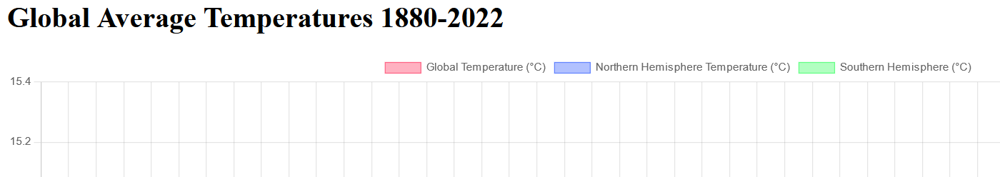

# Fetching Exercise

## Description

Simple display of global temperature data on a chart, compared by hemispheres.
The data is provided by NASA and can be found [here](https://data.giss.nasa.gov/gistemp/).

## Technologies Used

* _HTML_
* _JavaScript_
* _CSS_

## Installation

* Clone this repository to your local machine.
* Open you command line with the path to the directory to this repository.
* Run npm install http-server and access the page on your browser.

## Contributions 

Pull requests are welcome. For major changes, please open an issue first to discuss what you would like to change.

## License

[MIT](./LICENSE)